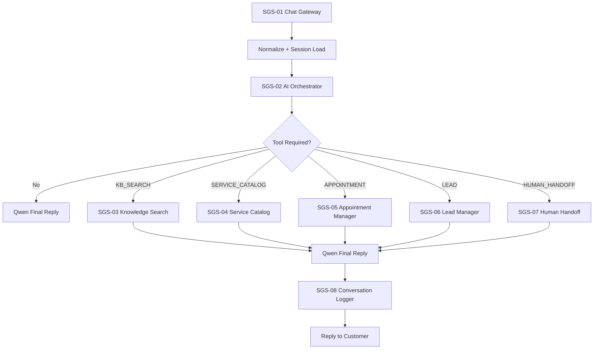

# SG Solutions Customer Service Chatbot (n8n + Qwen3:14B)

Professional production-ready modular automation for SG Solutions, designed around the architecture requested:

- Intent classification and language-aware response generation with Qwen3:14B.
- Tool orchestration in n8n, not in the LLM.
- Modular subworkflows for Knowledge Base, Service Catalog, Appointments, Leads, Human Handoff and Logging.
- Session aware responses and structured business events.
- Safe governance: no sensitive actions, explicit admin gates, and auditable logs.

Current included artifacts:

- Workflows JSON:
  - `workflows/SGS-01-Chat-Gateway.json`
  - `workflows/SGS-02-AI-Orchestrator.json`
  - `workflows/SGS-03-Knowledge-Search.json`
  - `workflows/SGS-04-Service-Catalog.json`
  - `workflows/SGS-05-Appointment-Manager.json`
  - `workflows/SGS-06-Lead-Manager.json`
  - `workflows/SGS-07-Human-Handoff.json`
  - `workflows/SGS-08-Conversation-Logger.json`
- Prompts:
  - `prompts/qwen-system-prompt.md`
  - `prompts/intent-classifier-prompt.md`
- Contracts:
  - `contracts/sgs-contracts.json`
- Sources:
  - `data/service-catalog.json`
  - `data/knowledge-base.json`
- Config:
  - `.env.example`
- Guides:
  - `docs/installation-guide.md`
  - `docs/configuration-guide.md`
  - `docs/testing-guide.md`
  - `docs/conversation-examples.md`
  - `docs/phase-plan.md`
  - `docs/credentials-and-integrations.md`

## Delivery status

- IMPLEMENTED:
  - Modular workflow architecture and interfaces
  - Structured intent output contract
  - Multi-language (es/en) support in prompt routing
  - Service catalog and KB contracts in separable sources
  - Appointment tool contracts and safety guardrails
  - Lead capture/update contract
  - Human handoff and escalation contracts
  - Logging and observability event contract
  - Error branches in every major module
  - Full documentation set

- REQUIRES_CONFIGURATION:
  - Concrete endpoint URLs, credentials and IDs in `.env.example`
  - Calendar, CRM, session store and logger endpoints
  - Service catalog and KB source replacement if you do not want in-workflow static defaults
  - Workflow permissions (`This workflow can be called by`) for cross-call design

- OPTIONAL_NEXT_STEPS:
  - Replace static catalog/KB with DB/CRMs
  - Add vector search for semantic KB retrieval
  - Add channel adapters for WhatsApp, SMS, Instagram, phone
  - Add admin approval UI for protected actions

## Quick start

1. Follow `docs/installation-guide.md`
2. Configure environment variables from `.env.example`
3. Import workflows in dependency order:
   1) `SGS-03, SGS-04, SGS-05, SGS-06, SGS-07, SGS-08`
   2) `SGS-02`
   3) `SGS-01`
4. Validate each workflow individually with sample payloads from `docs/testing-guide.md`
5. Activate `SGS-01` first for channel intake.

## End-to-end architecture summary

`SGS-01` receives messages from chat channel webhooks and forwards normalized payload to `SGS-02`.

`SGS-02` classifies intent, detects language, and routes:

- KB and pricing/service information to `SGS-03` and `SGS-04`
- Booking tasks to `SGS-05`
- Lead events to `SGS-06`
- Escalation to `SGS-07`

Final answer and context are returned to `SGS-01`, logged by `SGS-08`, then sent to customer.

This structure allows adding channels by duplicating only the Chat Gateway webhook input map and reusing the orchestration layer.
